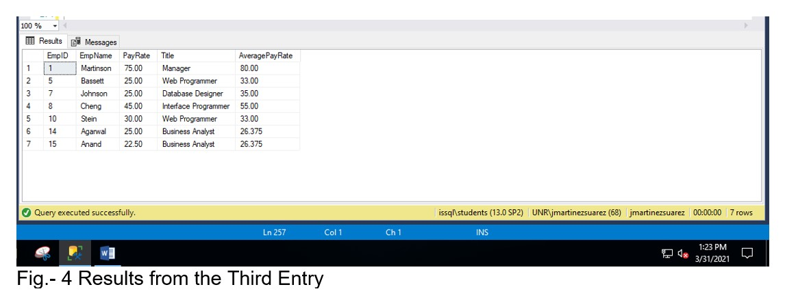

# SQL Subqueries, Views, and Common Table Expressions (CTEs)


A total of six SQL tables were created using the SQL Server Management Studio (SQL-SMS) and following the Entity Relationship Diagram (ERD) provided in Fig.- 1


The below SELECT commands were executed on the SQL Server Management Studio.

```
SELECT * FROM yEmp; 
SELECT * FROM yProd; 
SELECT * FROM yOrd; 
SELECT * FROM yOrderLine; 
SELECT * FROM yCust; 
SELECT * FROM yJobTitle;
```

The following SELECT commands were executed to identify which customers have orders in the order table:

```
SELECT * 
FROM yCust 
WHERE custid IN 
        (SELECT custid 
        FROM yOrd)
```

The below SELECT commands helps us to identify which customers do not have orders in the order table:

```
SELECT * 
FROM yCust 
WHERE custid NOT IN 
        (SELECT custid 
        FROM yOrd)
```

The below commands provide the orders that are not affiliated with an employee. In addition, the commands check for empid with null values.

```
SELECT * 
FROM yOrd 
WHERE empid NOT IN 
        (SELECT empid 
        FROM yEmp) 
OR empid is null
```

## FIRST ENTRY
To identify the employees with a pay rate that is less than or equal to the average employee pay rate the following commands were executed:

```
SELECT	EmpID,
		EmpName,
		PayRate,
		jt.Title,
		(SELECT AVG (payrate)
		FROM	yEmp) AveragePayRate
FROM	yemp	emp
INNER JOIN  yJobtitle jt
ON	emp.jobtitleid	= jt.jobtitleID
WHERE	payrate <= 
	(SELECT AVG (payrate)
	FROM	yemp)
ORDER BY emp.empid
```

The results from the First Entry are shown in Fig. 2 below.


## SECOND ENTRY
Modify the query from the First Entry to include the max and min pay rate for all employees from the SELECT list.

```
SELECT	EmpID,
		EmpName,
		PayRate,
		jt.Title,
		(SELECT AVG (payrate)
		FROM	yEmp) AveragePayRate,
		(SELECT MAX(payrate)
		FROM yEmp) MaximumPayRate,
		(SELECT MIN(payrate)
		FROM yEmp)	MinimumPayRate
FROM	yemp	emp
INNER JOIN  yJobtitle jt
ON	emp.jobtitleid	= jt.jobtitleID
WHERE	payrate <= 
	(SELECT AVG (payrate)
	FROM	yemp)
ORDER BY emp.empid
```

The results from the Second Entry are shown in Fig. 3 below.


## THIRD ENTRY
The Third Entry focuses on showing the use of the correlated subquery. The following SELECT commands identify those employees that have a higher payrate than the payrate for their job title.

```
SELECT EmpID,
	EmpName,
	PayRate,
	jt.Title
FROM yemp emp
INNER JOIN yjobtitle jt
ON emp.jobtitleid = jt.jobtitleid
WHERE payrate >
	(SELECT AVG(payrate)
	FROM yemp empINNER
	WHERE empinner.jobtitleid = emp.jobtitleid)
ORDER BY emp.empid
```

The following query adds the average pay rate for the corresponding job title.

```
SELECT EmpID,
	EmpName,
	PayRate,
	jt.Title,
	(SELECT AVG(payrate)
	FROM yemp empSELECT
	WHERE empSELECT.jobtitleid = emp.jobtitleid) AveragePayRate
FROM yemp emp
INNER JOIN yjobtitle jt
ON emp.jobtitleid = jt.jobtitleid
WHERE payrate >
	(SELECT AVG(payrate)
	FROM yemp empINNER
	WHERE empinner.jobtitleid = emp.jobtitleid)
ORDER BY emp.empid
```

The following query provides the employees with a payrate that is less than or equal to the average payrate for their job title.

```
SELECT	EmpID,
		EmpName,
		PayRate,
		jt.Title,
		(SELECT AVG(payrate)
		FROM	yemp empSELECT
		WHERE	empSELECT.jobtitleid = emp.jobtitleid)	AveragePayRate
FROM	yemp emp
INNER JOIN	yjobtitle jt
ON	emp.jobtitleid = jt.jobtitleid
WHERE	payrate <= 
		(SELECT AVG (payrate)
		FROM	yemp empINNER
		WHERE	empinner.jobtitleid = emp.jobtitleid)
ORDER BY emp.empid
```

The results from the Third Entry are shown in Fig. 4 below.




